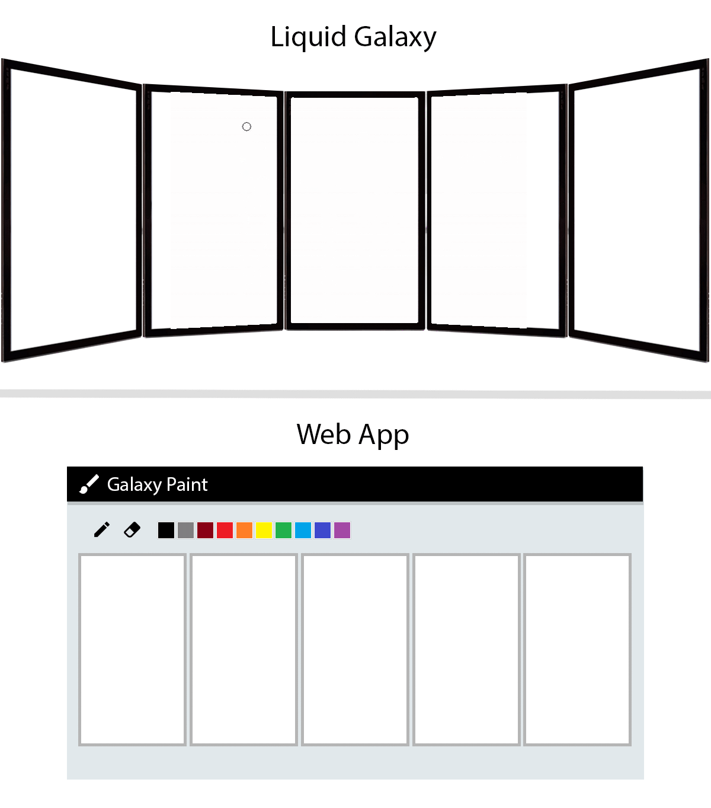

<h1 align="center">Galaxy Paint 🎨</h1>

<p>This project consists of a simple raster graphic editor, similar to "Microsoft Paint" but Liquid Galaxy based, where the user will be able to draw into multiple screens simultaneously, bringing an interactive, casual and fun experience, while also increasing the visibility of the Liquid Galaxy Plataform.</p>

<p align="center">
  
</p>

## 🚀 Technologies

This project was made using the following technologies:

- [HTML5](https://developer.mozilla.org/pt-BR/docs/Web/HTML)
- [CSS](https://developer.mozilla.org/pt-BR/docs/Web/CSS)
- [JavaScript](https://www.javascript.com/)
- [Socket.io](https://socket.io/)
- [Node.js](https://nodejs.org/en/)
- [Express JS](https://expressjs.com/)
- [Liquid Galaxy](https://liquidgalaxy.org/)

## 📝 Before Running
1. Make sure **Node.js** and **npm** are installed on the machine by running:
```bash
node -v
npm -v
```
2. The output should look someting like `v14.17.5` for Node.js and `6.14.10` for npm, if this is not the case use the following link to install them:
[Node.js Website](https://nodejs.org/en/)

## 💻 Running The Project
Firstly, clone the repository with the command:
```bash
git clone https://github.com/leoruas/galaxy-paint
```

Once the repository is cloned, navigate to the cloned folder and install the project's dependencies with the following commands:
```bash
cd galaxy-paint

npm install
``` 

Once the installation is finished you can run the project by running the command:
```bash
npm run server 3
```
The number 3 represents the amount of screens you wish to run the application for, if you don't inform this number it will default to 3.

With the server running, the application is going to be available in the 3000 port!

To open the controller use the url: localhost:3000/**controller**. 

To open the viewers, use  the url: localhost:3000/**[screenNumber]**,where [screenNumer] is the number of the screen represented by this tab,  e.g. screen 2 will be localhost:3000/**2**.